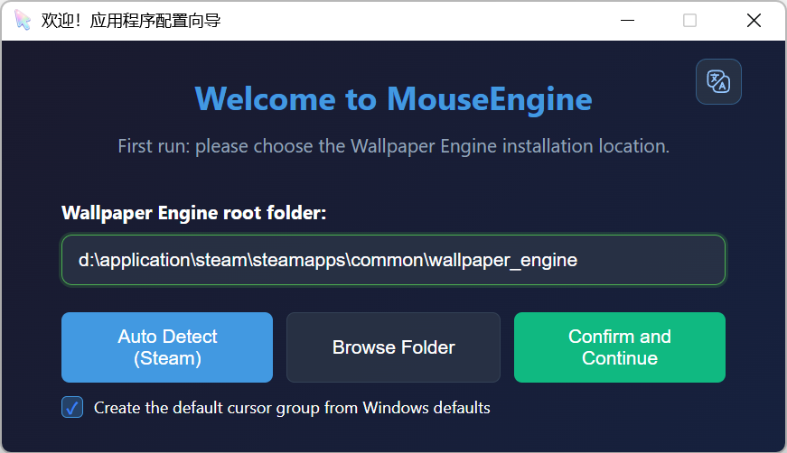
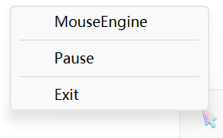
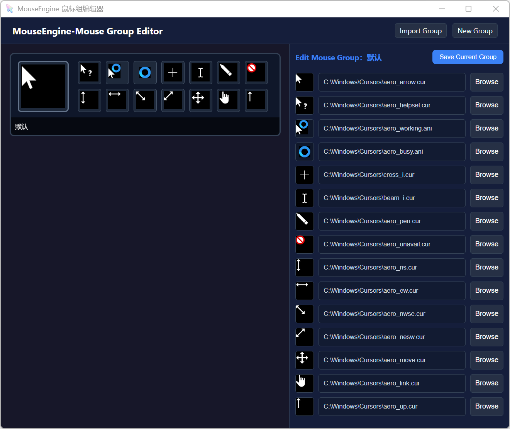
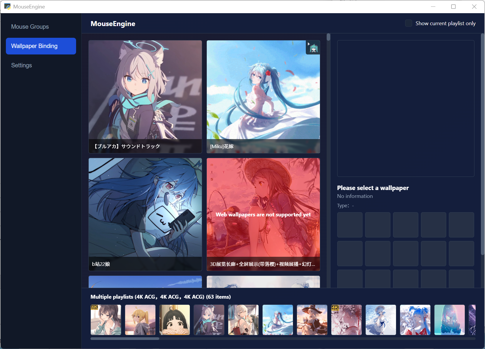
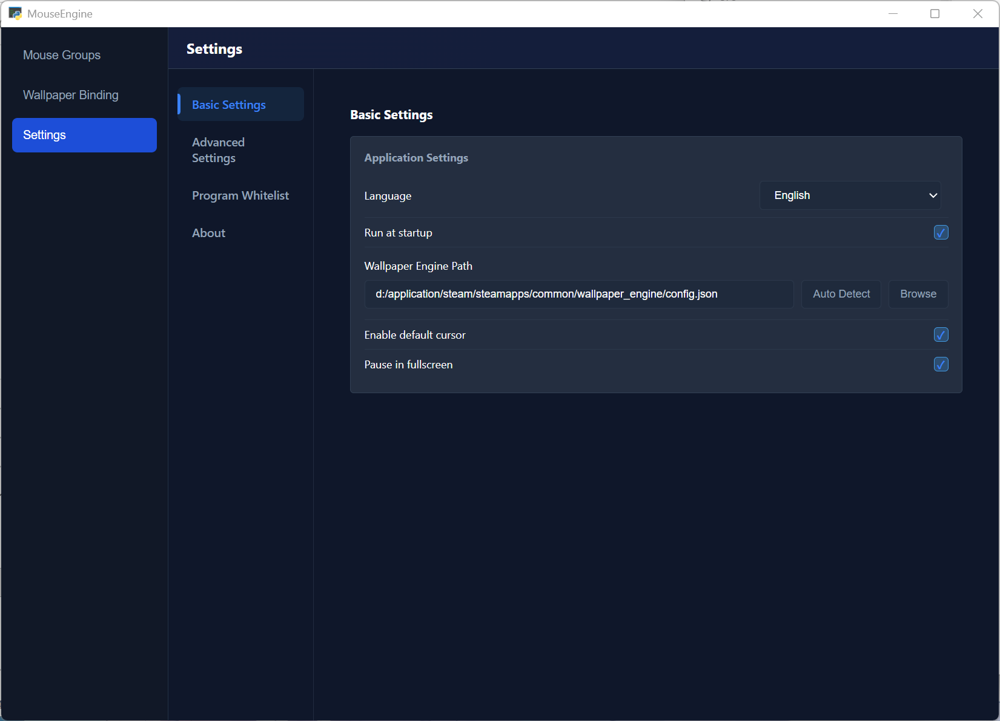

# MouseEngine

**Language / 语言**: [简体中文](./docs/README_ZH.md) | English | [日本語](./docs/README_JA.md)

MouseEngine is a **Windows cursor auto-switching tool for Wallpaper Engine**.

It reads the Wallpaper Engine wallpaper currently active on your display and automatically switches to the matching cursor theme.


---

## ✨ Features

- **Wallpaper-driven cursor switching**: Reads the current Wallpaper Engine wallpaper ID and applies the bound cursor group automatically.
- **Cursor group management**: Create, import, and edit cursor themes. Supports `.cur` / `.ani` cursor files.
- **Wallpaper binding UI**: Bind Wallpaper Engine wallpapers to cursor groups through a visual interface.
- **Program whitelist**: Bind cursor groups to specific applications. Whitelist rules take priority over wallpaper rules.
- **Default fallback**: Fall back to a default cursor group when a wallpaper is not bound or a cursor theme is invalid.
- **System tray resident mode**: Open configuration pages, pause/resume switching, adjust settings, and exit safely from the tray menu.
- **Multi-monitor support**: Switches cursors based on the display where the mouse pointer is located.
- **Multi-language UI**: Currently supports Simplified Chinese, English, and Japanese.

---

## 🧩 How It Works

1. Reads the Wallpaper Engine installation / configuration path from `config.toml`.
2. Uses `playliststate_reader.dll` to read Wallpaper Engine's runtime `playliststate.bin`.
3. Resolves the wallpaper project ID currently playing on the display where the mouse is located.
4. If the foreground program matches the whitelist, the whitelist cursor group is used first.
5. Otherwise, looks up the matching cursor group in `config.toml`.
6. Applies the cursor theme through Windows APIs.
7. If no rule matches, the app uses the default cursor group depending on the current settings.

---

## 🚀 Quick Start

### 1. Download and Extract

Download the release package from GitHub Releases:

[MouseEngine-V1.1](https://github.com/quanmouren/MouseEngine/releases/download/V1.1/MouseEngine-V1.1-windows-x64.zip)

After downloading, extract the package to the directory where you want to keep MouseEngine. A normal user directory or a dedicated tools directory is recommended. Avoid system directories that require administrator permission to write files.

### 2. First Launch

Double-click `MouseEngine.exe` in the extracted directory.



On first launch, MouseEngine will try to locate your Wallpaper Engine installation path automatically. After confirming the path, click "Confirm and Continue". The app will then run in the background and stay in the system tray.

Right-click the `MouseEngine` tray icon to open the main menu.



### 3. Configure Cursor Groups

Click the `Mouse Groups` tab on the left side of the menu.



Here you can create, import, and edit cursor groups. Each cursor group represents a Windows cursor theme.

### 4. Bind Wallpapers to Cursor Groups

Click the `Wallpaper Binding` tab on the left side of the menu.



Installed Wallpaper Engine wallpapers are shown on the left. Select a wallpaper, then bind the cursor group you want to use on the right.

### 5. Settings

Click `Settings` in the tray menu.



The settings page lets you configure the Wallpaper Engine path, startup behavior, default cursor group, fullscreen pause, language, and program whitelist.

---

## 🛠 Run From Source

> For developers or users who want to run MouseEngine directly from source.

### 1. Clone the Repository

```bash
git clone https://github.com/quanmouren/MouseEngine.git
cd MouseEngine
```

### 2. Install Dependencies

```bash
pip install -r requirements.txt
```

### 3. Start the App

```bash
cd src
python main.py
```

---

## 🔧 Project Structure (Reference)

```text
MouseEngine/
│
├─ README.md                         # English project documentation
├─ LICENSE.txt                       # Open-source license
├─ FINAL_THIRD_PARTY_NOTICES.txt     # Third-party dependency license notices
├─ requirements.txt                  # Python dependencies
├─ setMouse.dll                      # Native library for Windows cursor application
├─ docs/
│  ├─ README_ZH.md                   # Chinese documentation
│  ├─ README_JA.md                   # Japanese documentation
│  └─ images/                        # ZH / EN / JA doc screenshots and logo
│
└─ src/                              # ⭐ App runtime directory — cd here when launching via CLI
   ├─ main.py                        # Main entry: listener, tray menu, pause/exit
   ├─ Initialize.py                  # First-launch initialization and config repair
   ├─ WelcomeUI.py                   # First-launch wizard and old-version cleanup confirmation
   ├─ NewUI.py                       # Unified control center entry
   ├─ mainUIWeb.py                   # Wallpaper & cursor group binding UI API
   ├─ mouseUI.py                     # Cursor group editor API
   ├─ settingsUIWeb.py               # Settings UI API
   ├─ getActiveWallpaper.py          # playliststate-based current wallpaper / display reader
   ├─ getWallpaperConfig.py          # Parses Wallpaper Engine configuration
   ├─ setMouse.py                    # Windows cursor theme application logic
   ├─ mouses.py                      # Cursor group save/load and display mapping
   ├─ i18n_utils.py                  # Python-side language read/write and tray translation utilities
   ├─ path_utils.py                  # Unified path handling, compatible with source and packaged builds
   ├─ Tlog.py                        # Logging module
   ├─ ani_to_gif.py                  # .ani cursor preview conversion
   ├─ cur_to_png.py                  # .cur cursor preview conversion
   ├─ mouse_probe.dll                # Native library for window/mouse display detection
   ├─ playliststate_reader.dll       # Native library for Wallpaper Engine playliststate reading
   ├─ config.toml                    # Main configuration file
   ├─ temp_storage.toml              # Runtime temporary state
   ├─ version.toml                   # App version information
   ├─ *.spec                         # PyInstaller packaging configs
   │
   ├─ mouses/                        # Cursor group directory — each subfolder is a cursor theme set
   │
   ├─ html/
   │  ├─ NewUI.html                  # Unified control center page
   │  ├─ mainUIWeb.html              # Wallpaper binding page
   │  ├─ mouseUI.html                # Cursor group editing page
   │  ├─ settingsUI.html             # Settings page
   │  ├─ welcomeUIWeb.html           # Welcome / initialization page
   │  ├─ upgradeConfirm.html         # Upgrade confirmation page
   │  ├─ js/                         # Page scripts, frontend i18n and pywebview bridge
   │  ├─ css/                        # Page styles
   │  ├─ components/                 # Reusable components
   │  ├─ image/                      # Frontend image assets
   │  └─ cache/                      # Preview cache
   │
   ├─ lib/                           # Helper libraries
   │  ├─ INFParser.py                # Parses .inf cursor theme files
   │  ├─ imgObj_to_cur.py            # Exports 2D editor output to .cur
   │  └─ get_monitor_by_cursor.py    # Identifies display by cursor position
   │
   └─ native/                        # Native DLL source code
      ├─ mouse_probe.c               # Window / mouse-position display detection
      ├─ playliststate_reader.c      # playliststate.bin parser
      └─ setMouse.c                  # System cursor application

```

---

## ⚙ Configuration (config.toml)

### 1) Wallpaper Engine Config File Path

The `[path]` section in `config.toml` stores the path to Wallpaper Engine's `config.json`:

```toml
[path]
wallpaper_engine_config = "D:/Steam/steamapps/common/wallpaper_engine/config.json"
```

The first-launch wizard and the "Auto Detect / Browse Folder" options in the Settings page will write this path automatically.

---

### 2) Wallpaper ID → Cursor Theme Mapping

```toml
[wallpaper]
3406760593 = "Dark Theme"
3409595232 = "Light Theme"
```

Notes:
- The left side is the Wallpaper Engine project ID.
- The right side is the folder name under `mouses/<theme name>/`.

---

### 3) Basic Settings

```toml
[config]
enable_default_icon_group = true  #Whether to enable the default cursor group when no match is found.
pause_on_fullscreen = false       #Whether to pause switching when a fullscreen program is detected.
strict_window_judgment = false    #Whether to use stricter mouse-position-based window detection.
show_more_menu = false            #Whether to show additional tray menu items.
language = "zh-CN"
specified_mouse_group = ""        #Temporarily force a specific cursor group. Leave empty to disable forced selection.
use_new_menu = true               #Whether to use the new unified tray menu entry.
```

---

### 4) Program Whitelist

```toml
[program_whitelist]
"Code.exe" = "Default"
"Photoshop.exe" = "Design Cursor"
```

Notes:
- The left side is the process name.
- The right side is the cursor group name.
- When the current foreground program matches the whitelist, the whitelist rule is applied before wallpaper rules.

---

## 🖱 Cursor Theme Structure

Each cursor theme is a folder, for example:

```text
mouses/Dark Theme/
└─ config.toml
```

Example:

```toml
[mouses]
Arrow = "arrow.cur"
Hand = "hand.cur"
Wait = "wait.ani"
```

(You can extend this with more entries according to your theme. Absolute and relative paths are both supported.)

---

## 🧪 FAQ

### Q1: The system tray icon does not appear. What should I check?

- Make sure the app is running in a Windows desktop session.
- If running from source, make sure `pystray` and `Pillow` are installed.
- Check whether security software is blocking the tray program.
- If using the packaged version, make sure the extracted directory is complete and you did not copy only `MouseEngine.exe`.

### Q2: Why do I see `portalocker not installed`?

- This is an optional warning indicating the file lock library is not installed.
- Single-instance usage usually works fine without it.
- Install the library to dismiss the warning:

```bash
pip install portalocker
```

### Q3: Why does the cursor not change after the wallpaper changes? / Why is the cursor displayed incorrectly?

- Make sure the Wallpaper Engine path is correct.
- Make sure the target wallpaper has been bound to a cursor group.
- Make sure the `.cur` / `.ani` files in the cursor group have valid paths.
- If the current foreground program matches the whitelist, the whitelist rule takes priority over wallpaper rules.
- If you are using multiple monitors, try the following troubleshooting steps:
    - If you have adjusted Windows display settings, restart your computer.
    - If you have reconnected any monitors, restart your computer.
    - If your monitor supports dual modes and you have switched the dual-mode state since booting, restart your computer.
    - If any monitor has been reconnected since booting, restart your computer.
    - If you have switched display modes, restart your computer.

### Q4: How do I switch the UI language?

Open the **Settings** page and select `Simplified Chinese`, `English`, or `Japanese` in the language option.

### Q5: Will updates be downloaded and installed automatically?

The current version does not support automatic online updates. Please download the new release package from GitHub Releases and replace files manually.

---

## 📜 License and Third-Party Notices

This project uses a **Combined Licensing Model**. Different modules follow different licenses.

### 1. License Scope

To balance original-work protection and community integration, this project is divided into the following parts:

| Module Type | Scope | License | Restrictions |
| :--- | :--- | :--- | :--- |
| **Core logic** | Original algorithms, core workflows, and project-specific features | **MouseEngine Non-Commercial License** | Free projects, personal projects, learning, research, and open-source non-commercial projects may use it freely. Commercial use requires permission from the author. |
| **Integration interfaces** | Wallpaper Engine integration, related UI, process monitoring, and system handle operations | **[BSD 3-Clause](https://opensource.org/licenses/BSD-3-Clause)** | Permissive license |
| **Utility modules** | Independent small helper utilities | **[MIT](https://opensource.org/licenses/MIT)** | Highly permissive license |

> **Note**: The license of each file is identified by its `SPDX-License-Identifier` header. If a file does not clearly state MIT, BSD 3-Clause, or another license, it is licensed under the MouseEngine Non-Commercial License by default.

---

### 2. Version and License Changes

This project changed its license starting from **Alpha 2.0**, and deprecated **CC BY-NC-SA 4.0** for core logic starting from **V1.0**:

* **V1.0 and later**: Uses the combined licensing model above. Core logic is licensed under the MouseEngine Non-Commercial License.
* **Alpha 2.0 through versions before V1.0**: Some core logic was licensed under **[CC BY-NC-SA 4.0](https://creativecommons.org/licenses/by-nc-sa/4.0/)**. Already published CC-licensed code remains licensed under that license, and the granted rights are not withdrawn.
* **Alpha 1.2 and earlier**: Remain under the **[BSD 3-Clause](https://opensource.org/licenses/BSD-3-Clause)** license. Permissions granted under previous licenses remain valid and are not withdrawn.

---

### 3. Disclaimers and Third-Party Rights

* **Wallpaper content**: MouseEngine only identifies and reads wallpaper metadata. All wallpaper assets (images, videos, IDs, etc.) belong to their respective authors on Steam Workshop.
* **No official affiliation**: This project is a personal project and is not affiliated with or endorsed by Wallpaper Engine or Steam.
* **Software use**: This software is provided "as is", without warranty of any kind. The author is not liable for any system damage or legal disputes caused by using this software.

For details, read the full **[LICENSE.txt](./LICENSE.txt)** file.

- Project license: `LICENSE.txt`
- Third-party notices: `FINAL_THIRD_PARTY_NOTICES.txt`

---

### 5. Interpretation of This License and Developer Rights

#### On the Irrevocability of Licenses:
For previously released versions of this project, the license that applied at the time of release will not be revoked:
- Code released under CC BY-NC-SA 4.0 — the public's already-granted rights to "non-commercial use, modification, and sharing" remain valid.
- Files released under BSD 3-Clause or MIT continue to follow their respective licenses.
- The author may adjust the licensing approach in future versions, but will not revoke rights already granted in previously released versions.

#### For Developers:
* **Free development**: Core logic may be used freely in free projects, personal projects, learning, research, and open-source non-commercial projects. Commercial use requires permission from the author.

* **Feature guarantees**: All content related to Wallpaper Engine integration (including main entry, UI, and necessary components) is licensed under BSD 3-Clause, and you may freely modify this content.

* **In a nutshell**: As long as you are not profiting from it, you can modify it however you want.

---

## 🤝 Contributions and Feedback

Issues and Pull Requests are welcome.
If you encounter a problem, please attach runtime logs and `config.toml` (remember to redact private paths) if possible.

---

## ⭐ Star History Trend

<div align="center">
  
</div>
