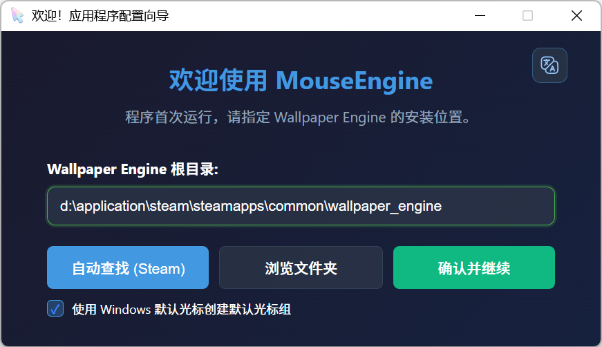
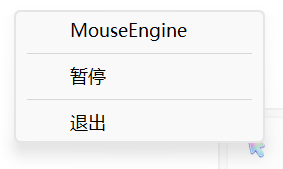
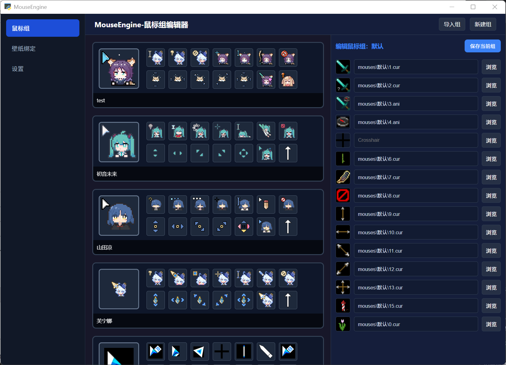
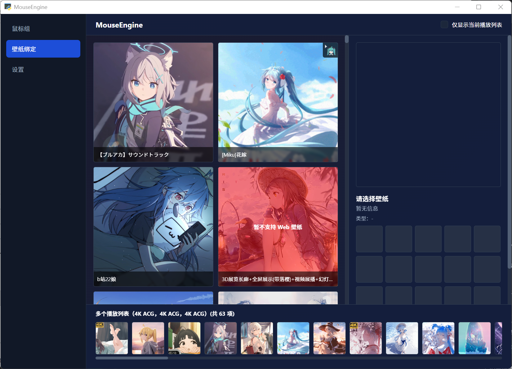
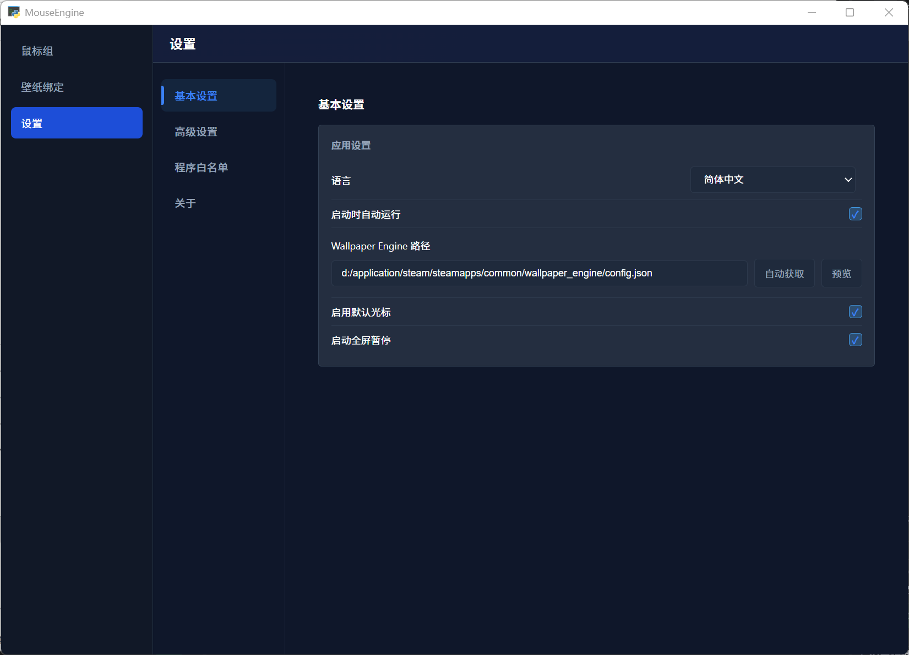

# MouseEngine

**语言 / Language**: 简体中文 | [English](./docs/README_EN.md) | [日本語](./docs/README_JA.md)

MouseEngine 是一个 **基于 Wallpaper Engine 的 Windows 鼠标指针自动切换工具**。  
它会根据当前显示器正在使用的 Wallpaper Engine 壁纸，自动切换到对应的鼠标指针主题。


---

## ✨ 功能特性

- **壁纸驱动光标切换**：读取 Wallpaper Engine 当前壁纸 ID，并自动应用绑定的鼠标组。
- **鼠标组管理**：可创建、导入、编辑鼠标指针主题，支持 `.cur` / `.ani` 光标文件。
- **壁纸绑定界面**：以可视化方式为 Wallpaper Engine 壁纸绑定鼠标组。
- **程序白名单**：为指定应用单独绑定鼠标组，白名单优先于壁纸规则。
- **默认回退机制**：壁纸未绑定或主题异常时，可回退到默认鼠标组。
- **系统托盘常驻**：托盘菜单支持打开配置界面、暂停/恢复、设置和安全退出。
- **多语言界面**：现支持简体中文、英语、日语。

---

## 🧩 工作原理

1. 从 `config.toml` 读取 Wallpaper Engine 的安装 / 配置路径。
2. 通过 `playliststate_reader.dll` 读取 Wallpaper Engine 运行时的 `playliststate.bin`。
3. 根据鼠标所在显示器，解析该显示器当前正在播放的壁纸项目 ID。
4. 如当前前台程序命中白名单，则优先使用白名单绑定的鼠标组。
5. 否则在 `config.toml` 中查找壁纸 ID 对应的鼠标组。
6. 调用 Windows API 应用鼠标指针。
7. 若无匹配项，则根据设置决定是否使用默认鼠标组。

---

## 🚀 快速使用

### 1. 下载与解压

从 GitHub Releases 下载正式版压缩包：

[MouseEngine-V1.0](https://github.com/quanmouren/MouseEngine/releases/download/V1.0/MouseEngine-V1.0-windows-x64.zip)

下载完成后，将压缩包解压到你希望存放 MouseEngine 的目录。推荐放在普通用户目录或独立工具目录，避免放到需要管理员权限写入的系统目录。

### 2. 首次启动

双击解压目录中的 `MouseEngine.exe`。



首次启动时，程序会尝试自动查找 Wallpaper Engine 的安装路径。确认路径无误后，点击“确认并继续”。之后程序会进入后台运行状态，并在系统托盘中常驻。

右键托盘中的 `MouseEngine` 图标，可以打开主要功能菜单。



### 3. 配置鼠标组

点击托盘菜单中的 `配置鼠标组`。



在这里可以创建、导入、编辑鼠标组。每个鼠标组对应一套 Windows 鼠标指针配置。

### 4. 绑定壁纸与鼠标组

点击托盘菜单中的 `绑定鼠标组`。



左侧会显示 Wallpaper Engine 中已安装的壁纸。选择壁纸后，在右侧为其绑定需要使用的鼠标组即可。

### 5. 程序设置

点击托盘菜单中的 `设置`。



设置页可配置 Wallpaper Engine 路径、开机自启、默认光标组、全屏暂停、语言和程序白名单。

---

## 💡 使用建议

- 建议保留默认鼠标组。壁纸未绑定鼠标组或主题文件异常时，默认鼠标组可以作为回退方案。
- 程序需要在 Windows 桌面会话中运行，系统托盘和光标切换依赖 Windows 桌面环境。
- 当前版本不提供自动联网更新。更新时请前往 GitHub Releases 手动下载新版。

---

## 🛠 从源码运行

> 面向开发者或希望直接从源码运行的用户。

### 1. 克隆仓库

```bash
git clone https://github.com/quanmouren/MouseEngine.git
cd MouseEngine
```

### 2. 安装依赖

```bash
pip install -r requirements.txt
```

### 3. 启动程序

```bash
cd src
python main.py
```

---

## 🔧 详细说明

### 📁 项目目录结构（参考）

```text
MouseEngine/
│
├─ README.md                         # 项目说明与使用文档
├─ LICENSE.txt                       # 开源许可证
├─ FINAL_THIRD_PARTY_NOTICES.txt     # 第三方依赖许可证汇总
├─ requirements.txt                  # Python 依赖列表
├─ setMouse.dll                      # Windows 光标应用原生库
├─ docs/
│  ├─ README_EN.md                   # English documentation
│  ├─ README_JA.md                   # 日本語ドキュメント
│  └─ images/                        # 中 / 英 / 日文档截图与 Logo
│
└─ src/                              # ⭐ 程序运行目录，命令行启动请先进入此目录
   ├─ main.py                        # 主入口：监听器、托盘菜单、暂停/退出
   ├─ Initialize.py                  # 首次启动初始化与配置修复
   ├─ WelcomeUI.py                   # 首次启动向导与旧版本清理确认
   ├─ NewUI.py                       # 统一控制中心入口
   ├─ mainUIWeb.py                   # 壁纸与鼠标组绑定界面 API
   ├─ mouseUI.py                     # 鼠标组编辑器 API
   ├─ settingsUIWeb.py               # 设置界面 API
   ├─ getActiveWallpaper.py          # 基于 playliststate 的当前壁纸 / 显示器读取
   ├─ getWallpaperConfig.py          # 解析 Wallpaper Engine 配置
   ├─ setMouse.py                    # Windows 鼠标指针应用逻辑
   ├─ mouses.py                      # 鼠标组保存、读取与显示器映射
   ├─ i18n_utils.py                  # Python 侧语言读取、写入与托盘翻译
   ├─ path_utils.py                  # 统一路径解析，兼容源码与打包环境
   ├─ Tlog.py                        # 日志模块
   ├─ ani_to_gif.py                  # ani 光标预览转换
   ├─ cur_to_png.py                  # cur 光标预览转换
   ├─ mouse_probe.dll                # 窗口 / 鼠标所在显示器探测原生库
   ├─ playliststate_reader.dll       # Wallpaper Engine playliststate 读取原生库
   ├─ config.toml                    # 主配置文件
   ├─ temp_storage.toml              # 运行时临时状态
   ├─ version.toml                   # 程序版本信息
   ├─ *.spec                         # PyInstaller 打包配置
   │
   ├─ mouses/                        # 鼠标组目录，每个子目录是一套光标主题
   │
   ├─ html/
   │  ├─ NewUI.html                  # 统一控制中心页面
   │  ├─ mainUIWeb.html              # 壁纸绑定页面
   │  ├─ mouseUI.html                # 鼠标组编辑页面
   │  ├─ settingsUI.html             # 设置页面
   │  ├─ welcomeUIWeb.html           # 欢迎 / 初始化页面
   │  ├─ upgradeConfirm.html         # 升级确认页面
   │  ├─ js/                         # 页面脚本、前端 i18n 与 pywebview 桥接
   │  ├─ css/                        # 页面样式
   │  ├─ components/                 # 复用组件
   │  ├─ image/                      # 前端图片资源
   │  └─ cache/                      # 预览图缓存
   │
   ├─ lib/                           # 辅助库
   │  ├─ INFParser.py                # 解析 .inf 光标主题文件
   │  ├─ imgObj_to_cur.py            # 2D 编辑器导出 cur
   │  └─ get_monitor_by_cursor.py    # 根据光标位置识别显示器
   │
   ├─ native/                        # 原生 DLL 源码
   │  ├─ mouse_probe.c               # 窗口 / 鼠标所在显示器探测
   │  ├─ playliststate_reader.c      # playliststate.bin 解析
   │  └─ setMouse.c                  # 系统光标应用
   │
   ├─ projects/                      # 2D 编辑器项目目录
   │  └─ test_mouse/                 # 示例项目
   │     ├─ image/
   │     ├─ main.lua
   │     └─ project.toml
   │
   └─ ui/                            # 2D 编辑器 UI
      ├─ Cur2D_Editor.py             # 2D 编辑器主界面
      └─ widgets/                    # 自定义控件
         ├─ file_manager.py
         └─ lua_editor.py

```

---

## ⚙ 配置说明（config.toml）

### 1) Wallpaper Engine 配置文件路径

`config.toml` 中的 `[path]` 用于记录 Wallpaper Engine 的 `config.json` 路径：

```toml
[path]
wallpaper_engine_config = "D:/Steam/steamapps/common/wallpaper_engine/config.json"
```

首次启动向导或「设置」页面中的“自动查找 / 浏览文件夹”会自动写入该路径。

---

### 2) 壁纸 ID → 鼠标主题映射

```toml
[wallpaper]
3406760593 = "深色主题"
3409595232 = "浅色主题"
```

说明：
- 左边是 Wallpaper Engine 的项目 ID
- 右边是 `mouses/<主题名>/` 的文件夹名

---

### 3) 基础设置

```toml
[config]
enable_default_icon_group = true
pause_on_fullscreen = false
strict_window_judgment = false
show_more_menu = false
language = "zh-CN"
specified_mouse_group = ""
use_new_menu = true
```

说明：
- `enable_default_icon_group`：未匹配到鼠标组时是否启用默认鼠标组。
- `pause_on_fullscreen`：检测到全屏程序时是否暂停切换。
- `strict_window_judgment`：是否使用更严格的鼠标所在窗口判定。
- `show_more_menu`：是否显示更多托盘菜单项。
- `language`：界面语言，目前支持 `zh-CN`、`en` 与 `ja`。
- `specified_mouse_group`：临时指定使用的鼠标组，留空表示不强制指定。
- `use_new_menu`：是否使用新版统一托盘菜单入口。

---

### 4) 程序白名单

```toml
[program_whitelist]
"Code.exe" = "默认"
"Photoshop.exe" = "设计用光标"
```

说明：
- 左边是进程名。
- 右边是鼠标组名称。
- 当前前台程序命中白名单时，将优先使用白名单绑定的鼠标组。

---

## 🖱 鼠标主题结构说明

每个鼠标主题是一个文件夹，例如：

```text
mouses/深色主题/
└─ config.toml
```

示例：

```toml
[mouses]
Arrow = "arrow.cur"
Hand = "hand.cur"
Wait = "wait.ani"
```

（实际可按你的主题配置扩展更多项，此值支持绝对路径和相对路径）

---

## 🧪 常见问题（FAQ）

### Q1：系统托盘没有显示？

- 确认程序运行在 Windows 桌面会话中。
- 从源码运行时，确认已安装 `pystray` 和 `Pillow`。
- 检查是否有安全软件拦截托盘程序。
- 如果是打包版，确认解压目录中文件完整，没有只单独复制 `MouseEngine.exe`。

### Q2：提示 `portalocker not installed`？

- 这是可选警告：表示未安装文件锁库
- 单实例使用通常可以忽略
- 安装即可消除：

```bash
pip install portalocker
```

### Q3：为什么壁纸切换后光标没有变化？

- 确认 Wallpaper Engine 路径正确。
- 确认目标壁纸已经绑定鼠标组。
- 确认鼠标组中的 `.cur` / `.ani` 文件路径有效。
- 如果当前前台程序命中白名单，白名单规则会优先于壁纸规则。

### Q4：如何切换界面语言？

打开「设置」页面，在“语言”选项中选择 `简体中文`、`English` 或 `日本語`。

### Q5：更新版本时会自动下载安装吗？

当前版本不提供自动联网更新。请从 GitHub Releases 下载新版压缩包后手动替换。

---

## 📜 许可证与第三方声明

本项目采用**组合授权模型 (Combined Licensing Model)**，不同功能模块遵循不同的授权协议。

### 1. 授权划分
为了平衡原创保护与社区集成，本项目代码划分为以下部分：

| 模块类型 | 涵盖内容 | 采用协议 | 限制说明 |
| :--- | :--- | :--- | :--- |
| **核心逻辑** | 独创算法、核心业务流、项目特有功能 | **MouseEngine Non-Commercial License** | 免费项目、个人项目、学习研究、开源非商业项目可自由使用；商业使用需获得作者许可 |
| **联动接口** | 与 Wallpaper Engine 交互、Wallpaper Engine 相关UI、进程监控、系统句柄操作 | **[BSD 3-Clause](https://opensource.org/licenses/BSD-3-Clause)** | 宽松授权 |
| **通用工具** | 独立的小型辅助工具函数 | **[MIT](https://opensource.org/licenses/MIT)** | 极度宽松 |

> **注**：具体每个文件的授权情况，请参阅各文件头部的 `SPDX-License-Identifier` 标注。若某个文件没有单独标注 MIT、BSD 3-Clause 或其他许可证，则默认适用 MouseEngine Non-Commercial License。

---

### 2. 版本变更说明
本项目自 **Alpha 2.0** 版本起进行了协议调整，并自 **V1.0** 版本起弃用 CC BY-NC-SA 4.0：
* **V1.0 及后续版本**：采用上述组合授权模型，其中核心逻辑使用 MouseEngine Non-Commercial License。
* **Alpha 2.0 至 V1.0 之前的版本**：核心逻辑曾采用 **[CC BY-NC-SA 4.0](https://creativecommons.org/licenses/by-nc-sa/4.0/deed.zh)**。已发布版本的 CC 授权不会撤回，原有权利继续有效。
* **Alpha 1.2 及更早版本**：仍遵循原有的 **[BSD 3-Clause](https://opensource.org/licenses/BSD-3-Clause)** 协议。如果您使用的是旧版本代码，原有权利继续有效且不可撤销。

---

### 3. 免责声明与第三方权利
* **壁纸内容**：本软件联动功能仅用于识别和获取壁纸元数据。所有壁纸资产（图片、视频、ID 等）的版权归其在 Steam 创意工坊上的原作者所有。
* **官方关联**：本项目为个人开发，与 Wallpaper Engine 或 Steam 官方无任何隶属或背书关系。
* **软件使用**：本软件按“原样”提供，不附带任何形式的保证。作者不对因使用本软件导致的任何系统损害或法律纠纷负责。

更多详情，请阅读完整的 **[LICENSE.txt](./LICENSE.txt)** 文件。

- 本项目许可证：`LICENSE.txt`
- 第三方依赖声明：`FINAL_THIRD_PARTY_NOTICES.txt`

---

### 5. 对本许可证的解释与开发者权益说明
#### 许可协议的不可撤销性说明：
本项目已经发布过的版本，其当时适用的授权不会被撤回：
- 已按 CC BY-NC-SA 4.0 发布的代码，公众已经获得的“非商业使用、修改、分享”权利继续有效；
- 已按 BSD 3-Clause 或 MIT 发布的文件，仍遵循其对应许可证；
- 本人可在后续版本调整授权方式，但不会撤回已发布版本中已经授予的权利。

#### 对开发者：
* **自由开发**：免费项目、个人项目、学习研究、开源非商业项目均可自由使用核心逻辑；商业使用需获得作者许可。

* **功能保障**：关于与 Wallpaper Engine 联动相关内容均使用 BSD 3-Clause 许可证，包括主main、UI、及所需的必要组件，对于此内容您可以随意更改。

* **一言以蔽之**：只要不盈利你随便改

---

## 🤝 贡献与反馈

欢迎提交 Issue / Pull Request。  
如果你遇到问题，建议附上运行日志与 `config.toml`（注意隐藏隐私路径）。

---

## ⭐ Star 历史趋势

<div align="center">
  
</div>
