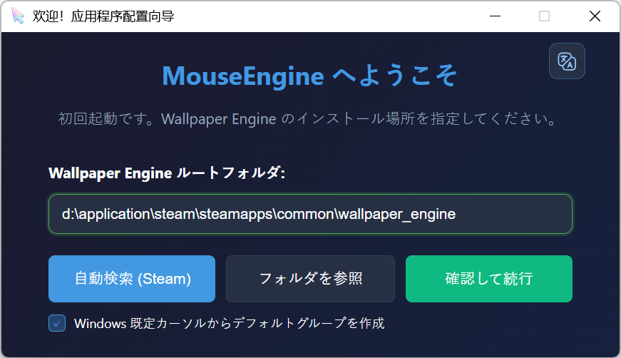
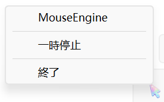
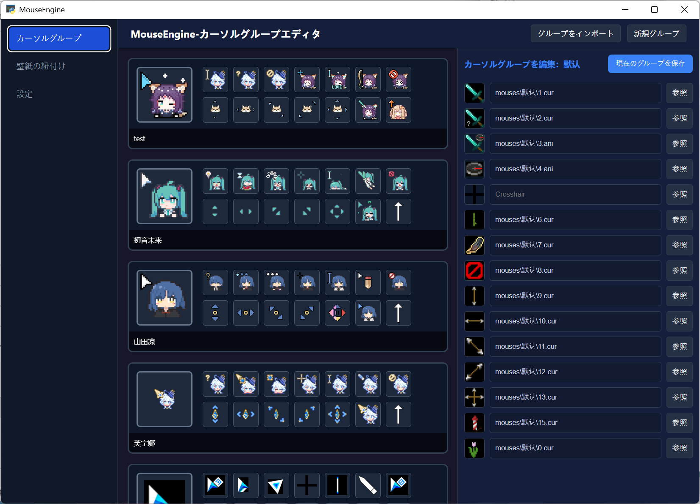
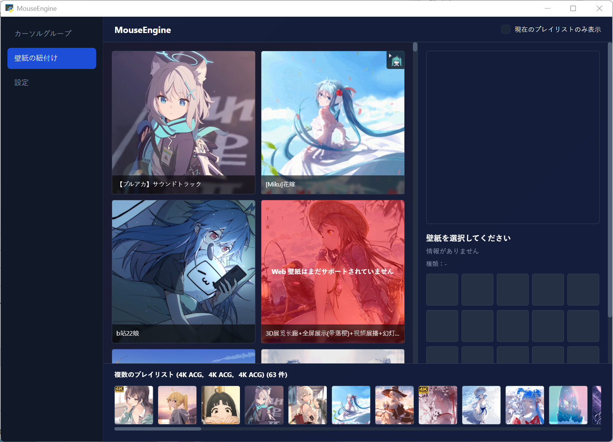
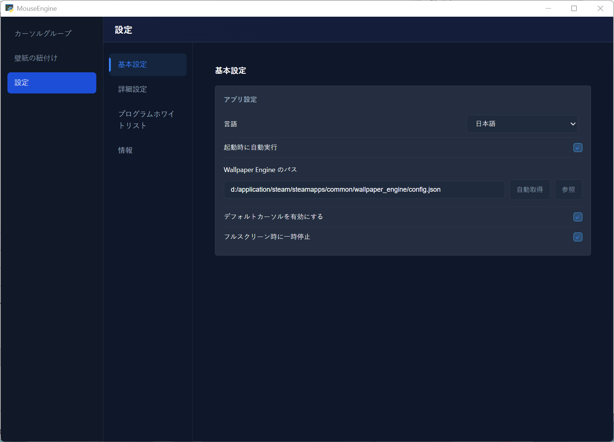

# MouseEngine

**言語 / Language**: [简体中文](../README.md) | [English](./README_EN.md) | 日本語

> この日本語ドキュメントは AI によって翻訳されています。実際の内容は中国語ドキュメントを基準とします。また、アプリ内の日本語翻訳は不完全、または一部不自然な場合があります。

MouseEngine は **Wallpaper Engine と連動して Windows のマウスカーソルを自動で切り替えるツール**です。

現在のディスプレイで使用されている Wallpaper Engine の壁紙を読み取り、その壁紙に対応するカーソルテーマへ自動で切り替えます。


---

## 主な機能

- **壁紙に応じたカーソル切り替え**: Wallpaper Engine の現在の壁紙 ID を読み取り、紐づけられたカーソルグループを自動で適用します。
- **カーソルグループ管理**: カーソルテーマの作成、インポート、編集ができます。`.cur` / `.ani` ファイルに対応しています。
- **壁紙との紐づけ UI**: Wallpaper Engine の壁紙とカーソルグループを視覚的に紐づけできます。
- **プログラム別ホワイトリスト**: 特定のアプリに個別のカーソルグループを設定できます。ホワイトリストは壁紙ルールより優先されます。
- **デフォルトへのフォールバック**: 壁紙が未設定の場合やテーマに問題がある場合、デフォルトのカーソルグループへ戻せます。
- **システムトレイ常駐**: トレイメニューから設定画面の表示、一時停止/再開、設定変更、安全終了ができます。
- **多言語 UI**: 現在、簡体中国語、英語、日本語に対応しています。

---

## 動作の仕組み

1. `config.toml` から Wallpaper Engine のインストール / 設定パスを読み取ります。
2. `playliststate_reader.dll` を使って、Wallpaper Engine の実行時 `playliststate.bin` を読み取ります。
3. マウスがあるディスプレイで現在再生中の壁紙プロジェクト ID を解析します。
4. 現在の前面アプリがホワイトリストに一致する場合、ホワイトリストのカーソルグループを優先します。
5. それ以外の場合は、`config.toml` から壁紙 ID に対応するカーソルグループを探します。
6. Windows API を使ってカーソルテーマを適用します。
7. 一致するルールがない場合、設定に応じてデフォルトのカーソルグループを使用します。

---

## クイックスタート

### 1. ダウンロードと展開

GitHub Releases からリリース版の zip をダウンロードします。

[MouseEngine-V1.0](https://github.com/quanmouren/MouseEngine/releases/download/V1.0/MouseEngine-V1.0-windows-x64.zip)

ダウンロード後、MouseEngine を置きたい場所に展開してください。通常のユーザーディレクトリや専用のツールフォルダをおすすめします。管理者権限が必要なシステムディレクトリは避けてください。

### 2. 初回起動

展開したフォルダ内の `MouseEngine.exe` をダブルクリックします。



初回起動時、MouseEngine は Wallpaper Engine のインストールパスを自動で探します。パスを確認したら、「確認して続行」をクリックしてください。その後、アプリはバックグラウンドで動作し、システムトレイに常駐します。

トレイ内の `MouseEngine` アイコンを右クリックすると、メインメニューを開けます。



### 3. カーソルグループの設定

トレイメニューから `カーソルグループを設定` を開きます。



ここではカーソルグループの作成、インポート、編集ができます。各カーソルグループは Windows のカーソルテーマに対応します。

### 4. 壁紙とカーソルグループの紐づけ

トレイメニューから `カーソルグループを紐づけ` を開きます。



左側に Wallpaper Engine にインストール済みの壁紙が表示されます。壁紙を選択し、右側で使用したいカーソルグループを紐づけます。

### 5. 設定

トレイメニューから `設定` を開きます。



設定画面では Wallpaper Engine のパス、スタートアップ、デフォルトカーソルグループ、フルスクリーン時の一時停止、言語、プログラム別ホワイトリストを設定できます。

---

## 使用上のヒント

- デフォルトのカーソルグループを残しておくことをおすすめします。壁紙が未設定の場合やカーソルテーマのファイルに問題がある場合の予備になります。
- MouseEngine は Windows のデスクトップセッション内で実行する必要があります。トレイメニューとカーソル切り替えは Windows デスクトップ環境に依存します。
- 現在のバージョンには自動オンラインアップデート機能はありません。更新時は GitHub Releases から新しいバージョンを手動でダウンロードしてください。

---

## ソースコードから実行

開発者、またはソースコードから直接実行したいユーザー向けです。

### 1. リポジトリをクローン

```bash
git clone https://github.com/quanmouren/MouseEngine.git
cd MouseEngine
```

### 2. 依存関係をインストール

```bash
pip install -r requirements.txt
```

### 3. アプリを起動

```bash
cd src
python main.py
```

---

## プロジェクト構成

```text
MouseEngine/
|
├─ README.md                         # 中国語ドキュメント
├─ LICENSE.txt                       # プロジェクトのライセンス表記
├─ FINAL_THIRD_PARTY_NOTICES.txt     # サードパーティ依存関係のライセンス表記
├─ requirements.txt                  # Python 依存関係
├─ docs/
│  ├─ README_EN.md                   # 英語ドキュメント
│  ├─ README_JA.md                   # 日本語ドキュメント
│  └─ images/                        # ドキュメント画像
|
└─ src/                              # アプリの実行ディレクトリ
   ├─ main.py                        # メイン入口: 壁紙監視、トレイメニュー、一時停止/終了
   ├─ Initialize.py                  # 初回起動初期化と設定修復
   ├─ WelcomeUI.py                   # 初回起動ウィザードと旧バージョン整理確認
   ├─ mainUIWeb.py                   # 壁紙とカーソルグループ紐づけ UI API
   ├─ mouseUI.py                     # カーソルグループエディタ API
   ├─ settingsUIWeb.py               # 設定画面 API
   ├─ getActiveWallpaper.py          # 現在のアクティブ壁紙を取得
   ├─ getWallpaperConfig.py          # Wallpaper Engine 設定を解析
   ├─ setMouse.py                    # Windows カーソルテーマ適用処理
   ├─ mouses.py                      # カーソルグループ保存/読み込みとディスプレイ対応
   ├─ i18n_utils.py                  # Python 側の言語・トレイ翻訳ユーティリティ
   ├─ path_utils.py                  # ソース実行とパッケージ版に対応したパス処理
   ├─ Tlog.py                        # ログモジュール
   ├─ ani_to_gif.py                  # `.ani` カーソルのプレビュー変換
   ├─ cur_to_png.py                  # `.cur` カーソルのプレビュー変換
   ├─ config.toml                    # メイン設定ファイル
   ├─ temp_storage.toml              # 実行時の一時状態
   ├─ version.toml                   # アプリのバージョン情報
   |
   ├─ mouses/                        # カーソルグループフォルダ
   ├─ html/                          # Web UI ファイル
   ├─ lib/                           # 補助ライブラリ
   ├─ projects/                      # 2D エディタのプロジェクト
   └─ ui/                            # 2D エディタ UI
```

---

## 設定

### 1. Wallpaper Engine 設定ファイルのパス

`config.toml` の `[path]` セクションには Wallpaper Engine の `config.json` のパスが保存されます。

```toml
[path]
wallpaper_engine_config = "D:/Steam/steamapps/common/wallpaper_engine/config.json"
```

初回起動ウィザードや設定画面の自動検出/フォルダ選択で、このパスを自動的に書き込めます。

### 2. 壁紙 ID からカーソルテーマへの対応

```toml
[wallpaper]
3406760593 = "Dark Theme"
3409595232 = "Light Theme"
```

- 左側は Wallpaper Engine のプロジェクト ID です。
- 右側は `mouses/<theme name>/` 配下のフォルダ名です。

### 3. 基本設定

```toml
[config]
enable_default_icon_group = true
pause_on_fullscreen = false
strict_window_judgment = false
show_more_menu = false
language = "zh-CN"
specified_mouse_group = ""
use_new_menu = true
```

- `enable_default_icon_group`: ルールに一致しない場合、デフォルトのカーソルグループを有効にします。
- `pause_on_fullscreen`: フルスクリーンアプリを検出したときにカーソル切り替えを一時停止します。
- `strict_window_judgment`: マウス位置を使った、より厳密なウィンドウ判定を使用します。
- `show_more_menu`: 追加のトレイメニュー項目を表示します。
- `language`: UI 言語です。現在は `zh-CN`、`en`、`ja` に対応しています。
- `specified_mouse_group`: 一時的に使用するカーソルグループを強制指定します。空欄の場合は強制指定しません。
- `use_new_menu`: 新しい統一トレイメニュー入口を使用します。

### 4. プログラム別ホワイトリスト

```toml
[program_whitelist]
"Code.exe" = "Default"
"Photoshop.exe" = "Design Cursor"
```

- 左側はプロセス名です。
- 右側はカーソルグループ名です。
- 現在の前面アプリがホワイトリストに一致する場合、壁紙ルールより先にホワイトリストのルールが使用されます。

---

## カーソルテーマの構造

各カーソルテーマは 1 つのフォルダです。例:

```text
mouses/Dark Theme/
└─ config.toml
```

例:

```toml
[mouses]
Arrow = "arrow.cur"
Hand = "hand.cur"
Wait = "wait.ani"
```

テーマに合わせて、さらに多くのカーソル項目を追加できます。値には絶対パスまたは相対パスを使用できます。

---

## FAQ

### Q1: システムトレイアイコンが表示されません。

- アプリが Windows のデスクトップセッション内で実行されているか確認してください。
- ソースコードから実行している場合、`pystray` と `Pillow` がインストールされているか確認してください。
- セキュリティソフトがトレイプログラムをブロックしていないか確認してください。
- パッケージ版の場合、展開先フォルダのファイルがすべて揃っているか確認してください。`MouseEngine.exe` だけをコピーしないでください。

### Q2: `portalocker not installed` と表示されます。

これはファイルロック用ライブラリが未インストールであることを示す任意の警告です。単一インスタンスでの使用では、多くの場合そのままでも問題ありません。

警告を消したい場合:

```bash
pip install portalocker
```

### Q3: 壁紙を切り替えてもカーソルが変わりません。

- Wallpaper Engine のパスが正しいか確認してください。
- 対象の壁紙にカーソルグループが紐づけられているか確認してください。
- カーソルグループ内の `.cur` / `.ani` ファイルのパスが有効か確認してください。
- 現在の前面アプリがホワイトリストに一致している場合、ホワイトリストのルールが壁紙ルールより優先されます。

### Q4: UI 言語を切り替えるには？

設定画面を開き、言語オプションで `简体中文`、`English`、または `日本語` を選択してください。

### Q5: MouseEngine は自動更新されますか？

いいえ。現在のバージョンには自動オンラインアップデート機能はありません。GitHub Releases から最新のリリースパッケージをダウンロードし、手動で置き換えてください。

---

## ライセンスとサードパーティ表記

本プロジェクトは **組み合わせライセンスモデル**を採用しています。モジュールごとに異なるライセンスが適用されます。

### 1. ライセンス範囲

独自部分の保護とコミュニティでの再利用を両立するため、本プロジェクトは次のように分けられます。

| モジュール種別 | 対象 | ライセンス | 備考 |
| :--- | :--- | :--- | :--- |
| **コアロジック** | 独自アルゴリズム、中心的な処理フロー、プロジェクト固有機能 | **MouseEngine Non-Commercial License** | 無料プロジェクト、個人プロジェクト、学習、研究、オープンソースの非商用プロジェクトでは自由に使用できます。商用利用には作者の許可が必要です。 |
| **連携インターフェース** | Wallpaper Engine 連携、関連 UI、プロセス監視、システムハンドル操作 | **[BSD 3-Clause](https://opensource.org/licenses/BSD-3-Clause)** | 寛容なライセンス |
| **ユーティリティモジュール** | 独立した小さな補助モジュール | **[MIT](https://opensource.org/licenses/MIT)** | 非常に寛容なライセンス |

> 注: 各ファイルのライセンスは、ファイル先頭の `SPDX-License-Identifier` で示されます。MIT、BSD 3-Clause、またはその他のライセンスが明記されていないファイルは、デフォルトで MouseEngine Non-Commercial License が適用されます。

### 2. バージョンとライセンス変更

本プロジェクトは **Alpha 2.0** からライセンスを変更し、**V1.0** からコアロジックに対する **CC BY-NC-SA 4.0** の使用を廃止しました。

- **V1.0 以降**: 上記の組み合わせライセンスモデルを採用します。コアロジックは MouseEngine Non-Commercial License です。
- **Alpha 2.0 から V1.0 より前のバージョン**: 一部のコアロジックは **[CC BY-NC-SA 4.0](https://creativecommons.org/licenses/by-nc-sa/4.0/)** で公開されていました。すでに公開済みの CC ライセンスコードは引き続きそのライセンスの対象であり、付与済みの権利は撤回されません。
- **Alpha 1.2 以前**: **[BSD 3-Clause](https://opensource.org/licenses/BSD-3-Clause)** ライセンスのままです。過去のライセンスで付与された権利は有効であり、撤回されません。

### 3. 免責事項とサードパーティの権利

- **壁紙コンテンツ**: MouseEngine は壁紙のメタデータを識別・読み取るためだけに使用されます。画像、動画、ID などすべての壁紙アセットの権利は、Steam Workshop 上の各作者に帰属します。
- **公式との関係なし**: 本プロジェクトは個人開発のプロジェクトであり、Wallpaper Engine、Steam、Valve とは提携・承認関係にありません。
- **ソフトウェアの使用**: 本ソフトウェアは「現状のまま」提供され、いかなる保証もありません。本ソフトウェアの使用によって生じたいかなるシステム損害や法的紛争についても、作者は責任を負いません。

詳細は [LICENSE.txt](../LICENSE.txt) を参照してください。

- プロジェクトライセンス: [`LICENSE.txt`](../LICENSE.txt)
- サードパーティ表記: [`FINAL_THIRD_PARTY_NOTICES.txt`](../FINAL_THIRD_PARTY_NOTICES.txt)

### 4. わかりやすい要約

- 無料、個人、学習、研究、オープンソースの非商用プロジェクトでは、MouseEngine を使用、学習、変更、fork、共有できます。
- コアロジックの商用利用には作者の許可が必要です。
- MIT または BSD 3-Clause と明記されたファイルは、そのファイル単位のライセンスに従って使用できます。
- サードパーティライブラリは、それぞれのライセンスに従います。
- 過去に公開済みのバージョンで付与されたライセンスは撤回されません。

一言で言うと、**利益目的でなければ自由に使ったり変更したりできます。商用利用には許可が必要です。**

---

## コントリビューションとフィードバック

Issue や Pull Request は歓迎します。

問題を報告する場合は、可能であれば実行ログと `config.toml` を添付してください。個人情報やプライベートなパスは隠してください。

---

## Star History

<div align="center">
  
</div>
