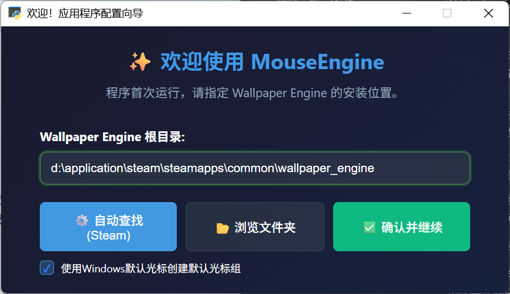
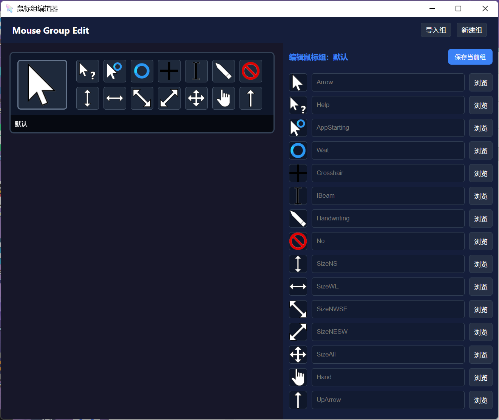
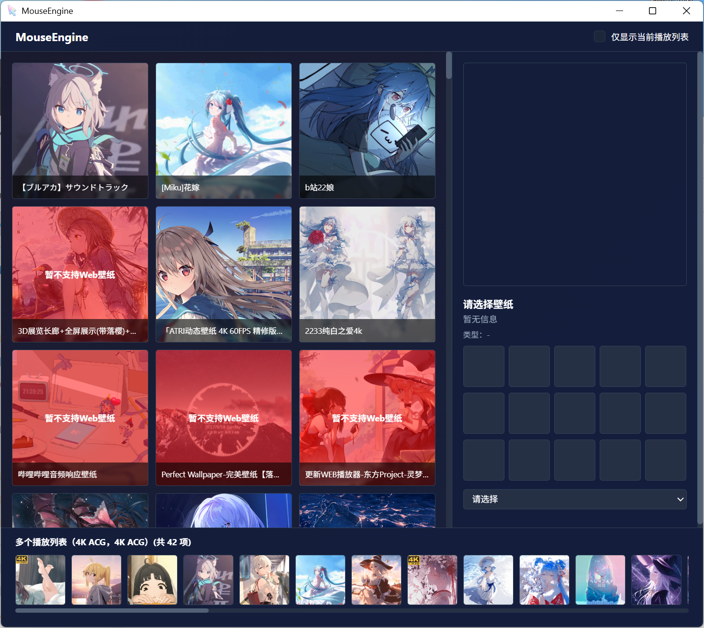
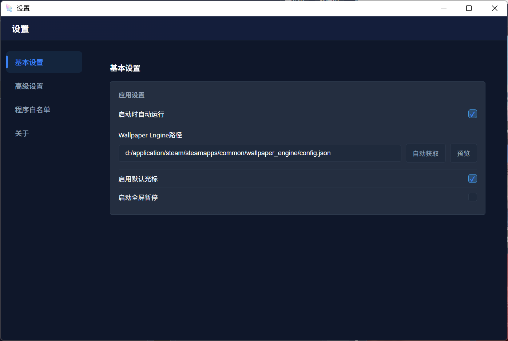

# MouseEngine

> 🤖 This English version is translated by Doubao AI.

MouseEngine is a **Windows mouse cursor auto-switching tool based on Wallpaper Engine**. It can **automatically switch mouse cursor themes** according to the wallpaper currently used on the display, with default fallback and system tray resident operation.


***

## ✨ Features

- 🎨 **Wallpaper-driven mouse cursor switching**
  - Reads current Wallpaper Engine wallpaper project ID
  - Automatically switches mouse cursor themes based on configuration and playlists
- ♻ **Default fallback mechanism**
  - Automatically uses default mouse cursor group when no mapping is configured
- ⚙ **Visual settings interface**
  - Wallpaper Engine path configuration
  - Default mouse cursor toggle
  - Quick playlist configuration and settings
- 📌 **System tray resident**
  - Background monitoring of wallpaper changes
  - Tray menu for quick access to configuration / settings
  - Safe exit

***

## 🧩 Working Principle Overview

1. Reads Wallpaper Engine's `config.json`
2. Gets the wallpaper project ID currently in use on the display
3. Starts a thread to monitor and get active wallpapers
4. Looks up the corresponding mouse theme in `config.toml`
5. Calls Windows API to apply mouse cursor
6. If no match is found, decides whether to use default theme based on settings

***

# 🚀 Quick Start

## 1. Download and Extract

First, obtain the software package: click the link [MouseEngine-Beta1](https://github.com/quanmouren/MouseEngine/releases/download/Beta1/MouseEngine-Beta1-windows-x64.zip) to download the software archive. After downloading, extract the archive to the location where you want to store it.

## 2. First-time Launch of Core Program

Find `MouseEngine.exe` in the extracted directory and double-click to launch it.



After the program starts, it will automatically detect and obtain the Wallpaper Engine installation path on your computer, and automatically fill it into the corresponding input box; after confirming the path is correct, click the "Confirm and Continue" button, and the program will enter silent running state (running in the background, no visible window, you can check the process status in Task Manager).

## 3. Configure Cursor Groups

Launch the `MouseGroupSettings.exe` program in the extracted directory



This tool is used for quick cursor group configuration:

- Supports quickly adding cursor groups by selecting existing cursor group configuration files through the "Import Group" option;
- You can also manually create new cursor groups and customize cursor styles, trigger logic and other parameters as needed.

## 4. Bind Wallpapers and Cursor Groups

Run the `WallpaperListSettings.exe` program



Bind specified cursor groups to wallpapers:

1. After the program starts, the left list will display all wallpapers installed in Wallpaper Engine;
2. Select the target wallpaper, and the right side will display checkboxes for the created cursor groups;
3. Check the cursor groups you need to bind to complete the association settings between wallpapers and cursor groups (after saving, the corresponding cursor group will be automatically loaded when starting that wallpaper).

## 5. Basic Program Settings

Open the `settings.exe` program



You can configure program operation related settings, here you can set the program to start automatically, after checking the corresponding option, the program will run automatically when the system starts.

## 💡 Note

This program enables the "default cursor settings" function by default: when no cursor group is bound to the wallpaper, or the bound cursor group cannot be loaded due to file corruption, path errors, etc., the program will automatically enable the default cursor configuration as an alternative to ensure normal cursor display and avoid cursor loss or style abnormality problems, it is recommended to configure the default cursor group.

***

## 🚀 Quick Deployment

> Suitable for first-time use / just want to get it running quickly

### 1) Clone the Repository

```bash
git clone https://github.com/yourname/MouseEngine.git
cd MouseEngine
```

### 2) Install Dependencies

```bash
pip install -r requirements.txt
```

### 3) Start the Program

```bash
cd src
python main.py
```

***

## 🔧 Detailed Deployment Instructions (Advanced)

### 📁 Project Directory Structure (Reference)

```text
MouseEngine/
│
├─ LICENSE
├─ README.md
├─ requirements.txt
├─ THIRD_PARTY_NOTICES.txt
│
├─ docs/
│  └─ licenses/              # Third-party dependency license originals
│
└─ src/                      # ⭐ Only running directory
   ├─ main.py                # Main entry (monitoring / tray)
   ├─ config.toml            # Main configuration file
   ├─ Initialize.py          # Initialization and configuration repair
   ├─ Tlog.py                # Log module
   ├─ ani_to_gif.py          # Handle ani format conversion
   ├─ cur_to_png.py          # Handle cur format conversion
   ├─ getActiveWallpaper.py  # Get active wallpaper
   ├─ getWallpaperConfig.py  # Wallpaper configuration parsing
   ├─ setMouse.py            # Mouse cursor switching logic
   ├─ mouses.py              # Display and theme parsing
   ├─ mainUIWeb.py           # Main interface
   ├─ settingsUIWeb.py       # Settings interface
   ├─ WelcomeUI.py           # Welcome interface
   ├─ mouseUI.py             # Mouse theme interface
   ├─ path_utils.py          # Unified path management
   │
   ├─ mouses/                # Mouse group folders
   │
   ├─ html/                  # Web interface resources
   │
   ├─ lib/                   # Library files
   │  ├─ INFParser.py        # Parse inf files to quickly add groups
   │  └─ imgObj_to_cur.py    # 2D editor
   │
   ├─ projects/              # Editor project directory
   │  └─ test_mouse/         # Example project
   │     ├─ image/
   │     ├─ main.lua
   │     └─ project.toml
   └─ ui/                    # UI related files
      ├─ widgets/            # Custom controls
      │  ├─ file_manager.py
      │  └─ lua_editor.py
      └─ Cur2D_Editor.py     #2D editor

```

***

## ⚙ Configuration Instructions (config.toml)

### 1) Wallpaper Engine Configuration File Path

Set the path to Wallpaper Engine's `config.json` in `config.toml`:

```toml
[path]
wallpaper_engine_config = "D:/Steam/steamapps/common/wallpaper_engine/config.json"
```

You can also fill it in and write it through the "Auto Find / Browse Folder" button in the "Settings" interface.

***

### 2) Wallpaper ID → Mouse Theme Mapping

```toml
[wallpaper]
3406760593 = "Dark Theme"
3409595232 = "Light Theme"
```

Description:

- The left side is the Wallpaper Engine project ID
- The right side is the folder name under `mouses/<theme name>/`

***

## 🖱 Mouse Theme Structure Instructions

Each mouse theme is a folder, for example:

```text
mouses/Dark Theme/
└─ config.toml
```

Example:

```toml
[mouses]
Arrow = "arrow.cur"
Hand = "hand.cur"
Wait = "wait.ani"
```

(You can actually expand more items according to your theme configuration)

***

## 🧪 Frequently Asked Questions (FAQ)

### Q1: System tray not showing?

- Ensure `pystray` and `Pillow` are installed
- Ensure running in an environment with "desktop session"
- Use the same Python/venv to run `main.py`

### Q2: Prompt `portalocker not installed`?

- This is an optional warning: indicates file lock library is not installed
- Usually can be ignored for single instance use
- Install to eliminate:

```bash
pip install portalocker
```

### Q3: Log prompts "No theme found for wallpaper ID", mouse doesn't change?

- Add the wallpaper ID mapping in `[wallpaper]` section of `config.toml`
- Or enable `[config] enable_default_icon_group = true` as fallback

***

## 🚧 Development Progress and Issues

### 🔄 Features in Development

- Web type wallpaper adaptation (currently in development, not yet supported)
- ~~Application whitelist (set exception application rules and specific application rules)~~ Completed
- Timer to further reduce resource usage
- Multi-monitor adaptation
- Refactor handle-related content using Rust to further reduce resource usage
- Configuration export/import synchronization

### ❌ Unsupported/No Plan Features

- EXE type wallpapers (no support plan for now)

### 🛠 Core Development Tasks

- Core function modules (yes, not yet written)
- 2D renderer

### 🐛 Beta1 Known Issues

- When wallpaper loading preview filenames are duplicate, preview image generation will be skipped
- Program uses json result for initial loading at startup, should use handle scan result
- Wallpaper ID not locked in fullscreen disabled state, may not take effect occasionally
- Wallpaper cache not working (does not affect usage)

***

## 📜 License and Third-Party Notices

This project adopts a **Combined Licensing Model**, with different functional modules following different open source licenses.

### 1. License Classification

To balance original protection and community integration, this project's code is divided into the following parts:

| Module Type               | Covered Content                                                                                              | Adopted License                                                           | Restriction Notes                           |
| :------------------------ | :----------------------------------------------------------------------------------------------------------- | :------------------------------------------------------------------------ | :------------------------------------------ |
| **Core Logic**            | Original algorithms, core business flow, project-specific functions                                          | **[CC BY-NC-SA 4.0](https://creativecommons.org/licenses/by-nc-sa/4.0/)** | Attribution, **Non-commercial**, ShareAlike |
| **Integration Interface** | Interaction with Wallpaper Engine, Wallpaper Engine related UI, process monitoring, system handle operations | **[BSD 3-Clause](https://opensource.org/licenses/BSD-3-Clause)**          | Permissive license                          |
| **General Tools**         | Independent small helper functions                                                                           | **[MIT](https://opensource.org/licenses/MIT)**                            | Extremely permissive                        |

> **Note**: For the specific license status of each file, please refer to the `SPDX-License-Identifier` annotation at the top of each file.

***

### 2. Version Change Notes

This project has adjusted its license since **Alpha 2.0** version:

- **Alpha 2.0 and later versions**: Adopt the above combined licensing model.
- **Alpha 1.2 and earlier versions**: Still follow the original **[BSD 3-Clause](https://opensource.org/licenses/BSD-3-Clause)** license. If you are using older version code, the original rights remain valid and irrevocable.

***

### 3. Disclaimer and Third-Party Rights

- **Wallpaper Content**: This software's integration function is only used to identify and obtain wallpaper metadata. All wallpaper assets (images, videos, IDs, etc.) are copyrighted by their original authors on the Steam Workshop.
- **Official Affiliation**: This project is a personal development and has no affiliation or endorsement relationship with Wallpaper Engine or Steam official.
- **Software Use**: This software is provided "as is" without any form of warranty. The author is not responsible for any system damage or legal disputes caused by the use of this software.

For more details, please read the complete **[LICENSE](../LICENSE)** file.

- Project license: `LICENSE`
- Third-party dependency list: `THIRD_PARTY_NOTICES.txt`
- Third-party license originals: `docs/licenses/`

***

### 4. Content in This Project "Not Subject to CC BY-NC-SA 4.0 Restrictions"

The following content is not original to me, and its use follows their respective independent license agreements, not subject to this project's CC BY-NC-SA 4.0 agreement restrictions:

***

### 5. Explanation of This License and Developer Rights

#### License Irrevocability Statement:

The CC BY-NC-SA 4.0 agreement adopted by some content of this project is an irrevocable public license:

- The public's right to "non-commercial use, modification, sharing" is permanently valid, and I will not revoke the authorization of released versions;
- I may stop updating the project, but released versions are still bound by the agreement.

#### For Developers:

- **Free Development**: As long as the content using the CC BY-NC-SA 4.0 agreement is not used for commercial purposes or profit, you can freely fork, modify, integrate or distribute derivative versions of this project without additional permission from me.
- **Function Guarantee**: All content related to Wallpaper Engine integration uses the BSD 3-Clause license, including main, UI, and necessary components, and you can freely modify this content.
- **In a nutshell**: As long as you don't make a profit, you can modify it as you like

***

## 🤝 Contributions and Feedback

Welcome to submit Issues / Pull Requests.\
If you encounter problems, it is recommended to attach running logs and `config.toml` (note to hide private paths).

***

## ⭐ Star History Trend

<div align="center">
  
</div>
